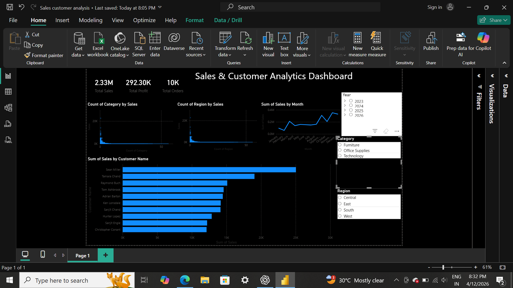

# Sales & Customer Analytics Dashboard

## Project Overview
This project analyzes sales and customer data to extract business insights and visualize them using Power BI.

## Tools Used
- Python (Pandas, Matplotlib)
- Power BI
- Excel/CSV

## Key Insights
- Identified top-performing product categories
- Analyzed regional sales performance
- Found high-value customers
- Observed monthly sales trends

## Files Included
- analysis.py → Data analysis using Python
- superstore.csv → Dataset
- dashboard.pbix → Power BI dashboard
- dashboard.png → Dashboard preview

  ## Key Findings

1. **Discounting drives losses, not low sales volume**: loss-making orders 
   carry an average discount of 48% vs just 8% on profitable orders — a 6x gap.
2. **Central region has the most loss-making orders (747)**, nearly 3x South's 
   count (259), despite having lower total sales than East or West.
3. **Office Supplies loses money most often** (898 loss-making transactions) 
   even though Technology sells more overall — Technology is the healthiest 
   category (only 271 loss-making orders).

## Recommendations
- Cap or require approval for discounts above ~20-25%, especially in Central 
  region and Office Supplies category
- Investigate why Central discounts so heavily compared to other regions

## Dashboard Preview

